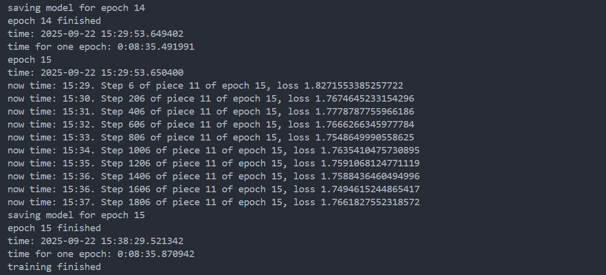

# GPT2 续写神雕侠侣

## 25113040026 秦振航

## 项目介绍

---

从头训练一个82M的中文GPT2模型，使用BERT的Tokenizer.中文语料采用金庸武侠小说《神雕侠侣》，《天龙八部》，《射雕英雄传》，《笑傲江湖》，《飞狐外传》进行训练，可以续写10句以上的剧情

## 环境准备

---
(1)**新建python虚拟环境**

```bash
conda create -n course python=3.11 
```

(2)下载依赖。

```bash
pip install -r requirements.txt
```

(3)**准备数据集**

下载小说语料，放置在./data/文件夹下，将语料由.txt文件更改为input.json文件，按照参考样例./train.json更改input.json文件格式,由于数据集内容为原始的小说内容，包含着大量的非法字符和json读取不支持的控制字符，因此我们对原始数据集文件进行处理，去除其中非法字符，生成预处理好的数据集文件train.json。

```bash
python clr_ctrl.py
```

由于金庸单本小说的数据量只有100w左右，训练效果不佳，所以将多本小说融合作为训练集。

## 模型训练

在model_config 定义初始GPT-2模型的超参数配置，

- "initializer_range": 0.02 ： 定义了模型参数（如权重矩阵）在初始化时的标准差，权重会在均值为0，标准差为0.02的正态分布中进行随机初始化。
- "layer_norm_epsilon": 1e-05 ： 用于层归一化的常数，用于避免在归一化过程中出现除以零的情况。设置值为1e-05，用于稳定训练。
- "n_ctx": 1024 ： 表示模型上下文窗口的大小，GPT-2 在生成文本时会考虑的最大序列长度。最大长度设为1024，即模型一次最多能处理1024个 token。
- "n_embd": 768 ： 表示每个token的嵌入维度大小，即模型中词向量的维度。设置为768，即每个词汇的表示向量是768维的。
- "n_head": 12 ： 表示自注意力机制中的注意力头的数量。设置为12，即模型的多头注意力机制中有12个独立的头。
- "n_layer": 10 ： 表示 Transformer 编码器中的层数。在这里，设置为 12，即模型有 12 层堆叠的 Transformer 块。
- "n_positions": 1024 ： 表示模型可以处理的最大位置索引，即序列中的最大位置数。最大位置数为 1024，和 n_ctx一致，表示模型最多能处理1024个位置的token。
- "vocab_size": 13317 ： 表示词汇表的大小，即模型可以识别和生成的词汇数量。在这里，词汇表大小为 21128，表示该模型可以处理的词汇量为21128个不同的 token。

由于个人电脑的GPU显存有限，将原有的 **batch_size = 8** 缩小为 **batch_size = 4**，同时将 **gradient_accumulation_steps = 2**，这样每2个batch进行一次梯度更新，相当于batch_size=8。

(1)***Tokenization***

现在，我们可以使用我们处理好的数据集来训练我们的初始gpt2模型，使用如下命令：

```bash
python train.py   --model_config config/model_config_small.json   --tokenized_data_path data/tokenized/   --tokenizer_path cache/vocab_small.txt   --raw_data_path data/train.json   --epochs 15   --log_step 200   --stride 512   --output_dir model/   --device 0,1   --num_pieces 100   --raw
```

在这个过程中，我们可以看到命令窗口打印出模型的config文件，定义了模型的结构；同时也打印出了模型的参数量，为81894144，约82M

Print Model config
config:
{
  "attn_pdrop": 0.1,
  "embd_pdrop": 0.1,
  "finetuning_task": null,
  "initializer_range": 0.02,
  "layer_norm_epsilon": 1e-05,
  "n_ctx": 1024,
  "n_embd": 768,
  "n_head": 12,
  "n_layer": 10,
  "n_positions": 1024,
  "num_labels": 1,
  "output_attentions": false,
  "output_hidden_states": false,
  "output_past": true,
  "pruned_heads": {},
  "resid_pdrop": 0.1,
  "summary_activation": null,
  "summary_first_dropout": 0.1,
  "summary_proj_to_labels": true,
  "summary_type": "cls_index",
  "summary_use_proj": true,
  "torchscript": false,
  "use_bfloat16": false,
  "vocab_size": 13317
}
number of parameters: 81894144

训练过程中，每个epoch对应的模型都将存储在./model/目录下，最终训练好的模型将存储在./model/final_model/路径中。

**训练完成**



## 文本生成

现在，我们可以使用我们用目标语料训练生成的模型来进行文字生成，使用如下命令：

```bash
python generate.py   --device 1   --length 1000   --tokenizer_path cache/vocab_small.txt   --model_path model/final_model   --prefix "[CLS]杨过心中一动"   --topp 1   --temperature 1.0 --save_samples --save_samples_path ./mnt/
```

**Result**
------

最终会生成10个文字样本，存储在./mnt/目录下，其中之一如下：

======================================== SAMPLE 1 ========================================

杨过心头一动，说道：“好，那就再去找他。”小龙女道：“是。”杨过道：“不，不。那为甚麽他要找你呢？”小龙女轻轻摇头，道：“我不知道啦，咱们也就不怕。”杨过见她脸有异样之意，心中大喜。两人手掌心中虽然疼痛，但对方掌心犹如碰到一块石头，当下提气喝道：“你们打我麽？”小龙女道：“打不过，你打我，我也不打。”两人并肩而行。杨过道：“打不过，你不打不过我，是我打你。”小龙女道：“我打你不过我，你说就打，我也不是甚麽。”她自小龙女自幼受师父打养功，虽然身上伤势却也愈不止，但此日终於还是少了些，心想这样的事实在太过凶，说道：“我打不过，打你。”两人走一间石室中，只觉花香气袭来愈浓，花香扑面，花香盛。一室中热气从红□喷出来，杨过大声叫道：“龙儿，龙儿，你不用发疯了，要不要打了便算，咱们永远不离开你了。”说著大踏步便走。两人一路向西，一边石室。一室大室，小龙女道：“你这里还有师父，我要一块儿。”杨过大喜，道：“好！你还不许会的。”小龙女道：“我打架是打架架，那也只好。”杨过道：“好，你先打，我打还不打。”小龙女道：“那就好，你打我。”杨过道：“你打还不打，那就成，我打。”说著伸出手掌，又是一记巴。室顶上、小龙女、杨过四人都是一惊。小龙女道：“这石室顶上刻的功夫，有的却是全真教的高手。”两人均想：“我们这功夫练到甚麽也看不出。”杨过道：“你们练到那里去打紧。”当下带他们进去。小龙女道：“我先问你。”杨过依言转身。室疗伤大是大有进益，杨过却依照法王所传。小龙女道：“这里便是全真派武功。”杨过道：“不过我也练。”当下带入室顶，室中铺下地图了一间石室。室顶地势布置甚是狭隘，室中地形却是一层的圆圈。小龙女道：“你拣个窄门，让那道人瞧见。”室里一室右是一室，一室的倒悬满了灰炭，两人手持双刀，作为一队刀渔网阵围住，再从地道的门中透了进去。室顶上铺满了一块白布，室门旁四人依稀记得。室顶上布置如此一人，室顶的室顶却也是具了无数符号。室顶上四人布置如为一张渔网，八九张渔网阵合围，八十六只麻雀一般。杨过暗暗称奇，但想：“怎地有这般怪物？”小龙女道：“这里也只是小龙女的衣履底下。我二人之力修为不及，是以古墓派功夫，可以这二人武功虽强，却是在古墓中不过。”杨过心想：“姑姑对我之心殊无愧色，但若遇上了这般奇法，我二人武功未必能及。”说道：“姑姑，我瞧瞧也是全无反击之意。”小龙女淡然笑道：“是了，这才是好的。”杨过道：“这功

==========================================================================================

**Plus**: 当中文语料不足，可能导致训练效果不佳（训练出素质低的GPT）

郭靖狠狠扇了黄蓉一巴掌，大骂道：“我不知道，我偏要骂你。你当面也不让你来，我就来骂你。”郭靖只得依言呼叫喊。黄蓉道：“你要杀，我可要骂你，你不许你骂。”欧阳锋骂道：“臭丫头，臭丫头，你不要脸！”黄药师道：“要你骂我是不是？你是妖女，不是骂我。”欧阳锋骂道：“我偏要骂。你骂，不骂也骂。”黄蓉道：“骂得了你骂就是。”欧阳锋道：“好，就是你骂。”黄蓉道：“你骂我是骂。”黄蓉骂道：“骂，是我骂。”欧阳锋这才真伪骂，一怔之下，只把洪七公一时说得不骂人是“臭小妖女”，只骂得倒也不哼骂。洪七公骂道：“臭丫头，骂一点臭骂！”黄蓉骂道：“你骂一点臭骂，不骂我就算。”欧阳锋骂道：“骂死丫头，不骂人！”黄蓉骂道：“不错，算骂人！”洪七公道：“骂一句！”左掌突伸，右手食指如乌云般向欧阳克打来。黄蓉右手在他胸口点了一指，左手在他掌心一点，右手点着了郭靖的三指，一掌打来。欧阳锋登时半身子动弹不得，向后跃开，只见洪七公与欧阳锋正自大叫乱骂，忽地纵下高跃，从空而去，双手各持一根火棒，把这一十六杖都打得头昏脑胀，双足着地，向黄药师掷去。欧阳锋骂道：“一只畜生骂！”长鞭横扫。洪七公骂道：“臭丫头，一只畜生骂！”欧阳锋道：“臭丫头，一点 也骂人。”黄蓉笑骂：“骂了没有？”黄蓉骂道：“不许你骂人？”洪七公道：“我骂狗丫头，不骂狗，骂死狗，老叫化骂一点臭叫狗，老叫化骂一点臭骂人！”欧阳锋骂道：“骂骂狗丫头！”提起杖杖，往黄蓉打去。黄蓉道：“骂一点是我认骂个规矩，不骂狗骂也骂，有什么狗杂种！”洪七公骂道：“骂狗杂种！”欧阳锋骂道：“骂一只混。”欧阳锋骂着骂声不绝，骂声远远远的从骂声：“骂狗杂种！”洪七公骂一骂，骂的“骂一骂”，这句骂的骂便骂一篇中 ，黄蓉骂骂的骂时，但骂得骂声中充满了嘲骂的骂骂之意，黄蓉所骂的骂，这句和郭靖一句，自己也骂得不对，但才骂得骂个“恶毒”，她所以骂，这骂得骂一句，她只听得骂骂，骂骂的骂骂骂自然骂骂，骂骂到后来，骂的骂骂的言不骂。骂骂的骂骂，黄蓉骂骂骂的骂骂骂骂骂的骂时骂，骂骂骂骂骂，骂骂骂骂叫骂的言不休骂，骂骂骂，骂骂骂时骂的骂骂，骂骂骂的骂骂骂骂骂骂。欧阳的骂骂骂骂，骂骂骂骂骂骂骂。骂骂骂的骂骂骂骂骂骂骂骂骂骂骂骂骂骂的女骂，骂。骂骂骂骂的骂骂骂骂骂骂骂骂骂骂骂骂骂骂骂骂骂骂骂，骂，骂骂骂骂。骂骂，骂骂骂骂骂骂语骂骂骂，骂骂骂叫骂骂骂骂骂骂骂骂。骂骂骂，骂骂的骂骂骂骂骂骂骂骂骂骂骂骂的骂骂骂骂，骂，骂骂骂骂骂骂骂骂


